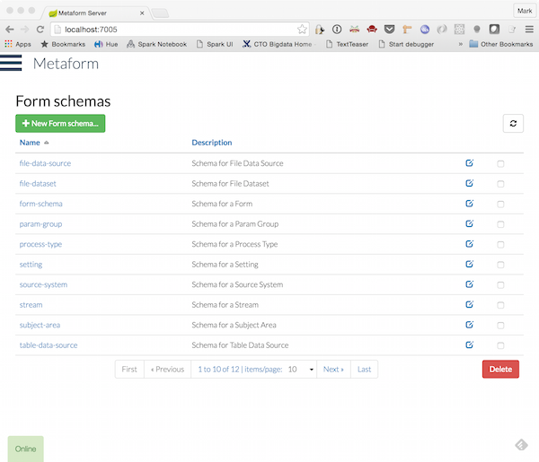

# formsapi

A server application for serving form schemas via an API. Also includes an admin interface for registering and maintaining forms. Designed to be used as part of a microservices architecture, able to serve the needs of multiple applications.

See the 'metaform' repository as an example client library to render the forms. Forms are defined using the JSON Schema standard.

In an 'inception' kind of way, the admin forms themselves are dynamic and managed by the Forms Server.

To build:

    ./gradlew clean build

To run:

    java -jar build/libs/formsapi-1.0.jar

### Architecture

The application uses Spring Boot combined with Spring Data REST.
